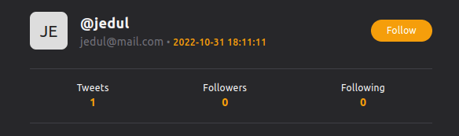
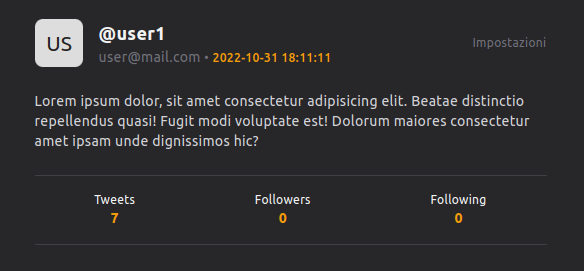

## Tweet app

This project is a simple twitter style application, developed using my [mvc framework](https://github.com/Jordan-Bianco/mvc_framework). 
A user can register on the site and, after verifying their account, start posting their tweets, visit other users' profiles, comment on other tweets and add or remove likes.  
In the user's dashboard, the user can change their profile information, change their password or delete their account.

### Following

After clicking the follow button, a record will be created in the database, with the follow request in pending state.
If you press the unfollow button, the record in the database is deleted.

> In the following demo, I am logged in as user1, and I am sending a follow request to jedul

The user who sent the follow request will find a pending request on his following list page. 
On this page, the logged in user will be able to manage his requests and the people he follows.

The user who received the request, on the other hand, will find it on the followers page, where he can decide whether to accept it or not.

> In the following demo I am logged in as jedul, and received the follow request from user1

inserire demo

La sezione dedicata alle richieste pending, accepted, declined è visibile solo all'utetne loggato, tutti gli altri utenti vedranno solo i followers per i quali la richiesta è stata accettata.

### Usage

-   Clone the project with "git clone nomerepo"
-   Run the command "composer install"
-   Enter the public folder
-   Launch the server with the command "php -S localhost:8888"
-   Create the .env file and copy the contents of the .env-example file by entering your credentials
-   Run the command php migrations.php
-   Run the command php seed.php

### Testing

Work in progress
