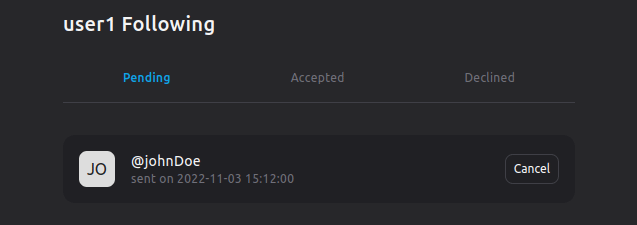

## Tweet app

This project is a simple twitter style application, developed using my [mvc framework](https://github.com/Jordan-Bianco/mvc_framework) and styled with tailwind css (cdn). 

A user can register on the site and, after verifying his account, start posting tweets, visit and follow other's users profile, comment on other tweets and add or remove likes. 
In the user's dashboard, it is possibile to change profile information, update the password, or delete an account.
 
The site is accessible to registered users only.

### Following system

The main feature of this small application is the follow/unfollow system.  
On the homepage of the logged-in user, will be shown only his tweets and those of the users he is following.

#### Sending a follow request

On a user's profile, you can send a follow request by clicking on the follow button.   After clicking the button, a record is stored in the database, containing the follower_id, the following_id and the status. (pending by default). 
If you press the button again, before the request is accepted or declined, the record in the database will be deleted. 
In the following demo, I am logged in as "user1", and I am sending a follow request to "johnDoe".

> <small><strong>note</strong></small> The followers / following count will not be updated till the request is accepted.

#### Managing follow requests

The user who sent a follow request will find a pending request on his following list page (accessible by clicking the counter of the following).
Here the logged in user can manage the requests sent (deleting them), as well as manage the users he already follows.

> <small><strong>note</strong></small> The section dedicated to pending, accepted and declined requests is visible only to the logged in user. All other users will only see the followers for which the request has been accepted.

On the other hand, the user who has received the request, will have a pending request on his followers page (accessible by clicking the counter of the followers). In this page the pending request can be accepted or declined.

### Installation

-   Clone the project with "git clone https://github.com/Jordan-Bianco/twitter-style-app.git"
-   Enter the folder and open the project with your editor
-   In the terminal run the command "composer install"
-   Create the .env file and copy the contents of the .env-example file by entering your credentials
-   Enter the public folder
-   In the terminal launch the server with the command "php -S localhost:8888"
-   In the terminal run the command php migrations.php
-   Optionally, run the command php seed.php, to populate the database with fake data.
